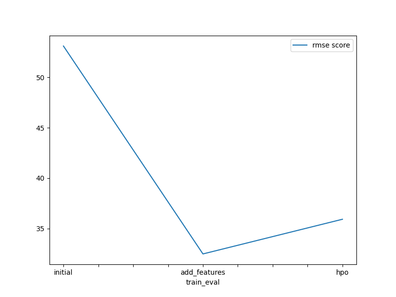
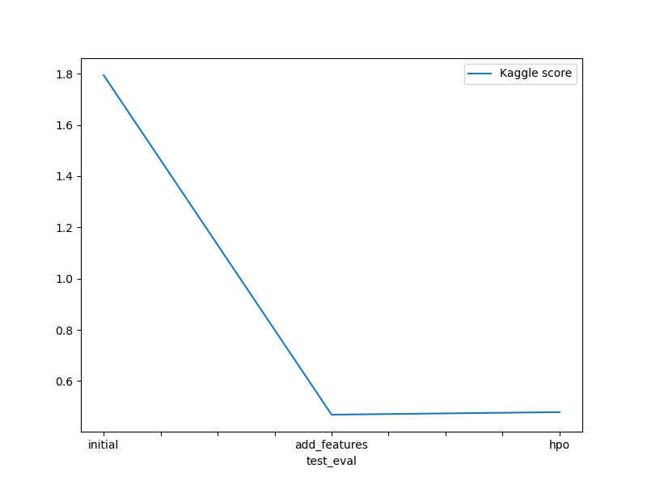

# Report: Predict Bike Sharing Demand with AutoGluon Solution
#### Anna Michelle Rakotoarinelina

## Initial Training
### What did you realize when you tried to submit your predictions? What changes were needed to the output of the predictor to submit your results?
When I tried to submit my predictions, I realize that the format of the features: parse date, some categorical data type considered as integer: season, weather, holiday and workingday, some columns that have no correlation on the target: datetime after spliting, casual and registered and the negative value on Kaggle submission need to be corrected.

### What was the top ranked model that performed?
The WeightedEnsemble_L3 with a validation rmse score of -32.490094 was my top ranked model.

## Exploratory data analysis and feature creation
### What did the exploratory analysis find and how did you add additional features?
Exploratory analysis shows that having more features help model to learn the pattern between features and target. If the training analysis did not identify the right data type or the category of the data, it will get confusing like the datetime column and some integer data and need to convert in categorical.
Also the data time is set up as an object data type. It should be changed in datetime in order to understand by the autogluon model. So I apply the parse date function. After that, I split datetime column into separate column as year, month, hour and dayofweek. The datetime column is dropped from the data. The histogram plot gave me insight that some columns type categorical like season, weather, holiday and workingday that need to convert into categorical data type.

### How much better did your model preform after adding additional features and why do you think that is?
My model perform better on the adding more features because if I refer to the Kaggle score, it shows an initial score of 1.79437 and becomes 0.46903. The additional features gives more importance and correlate more to the target.

## Hyper parameter tuning
### How much better did your model preform after trying different hyper parameters?
I choose to tune my hyper parameters by using 2 models and specifying the auto_stack=True in order to get more accuracy. The score was not improved because the Kaggle score was 0.46903 to 0.47898. I try to use on GBM model a space to allow the model to automaticaly choose the optimum value between the range.

### If you were given more time with this dataset, where do you think you would spend more time?
With more time, I will spend it on exploratory data analysis and also find the best way to optimize the hyperparameter.

### Create a table with the models you ran, the hyperparameters modified, and the kaggle score.
|model|LightGBM_BAG_L2|RandomForestMSE|LightGBM_BAG_L1|score|
|--|--|--|--|--|
|initial|Default|Default|presets: Best quality|1.79437|
|add_features|More column and change categorical column|feature engineering|presets: Best quality|0.46903|
|hpo|use_orig_features': True, 'max_base_models': 25, 'max_base_models_per_type': 5, 'save_bag_folds': True|use_orig_features': True, 'max_base_models': 25, 'max_base_models_per_type': 5, 'save_bag_folds': True, 'use_child_oof': True|use_orig_features': True, 'max_base_models': 25, 'max_base_models_per_type': 5, 'save_bag_folds': True|0.47898|

### Create a line plot showing the top model score for the three (or more) training runs during the project.

TODO: Replace the image below with your own.

### Create a line plot showing the top kaggle score for the three (or more) prediction submissions during the project.

TODO: Replace the image below with your own.

## Summary
Best score is based on our understanding of the data and the data analysis.

